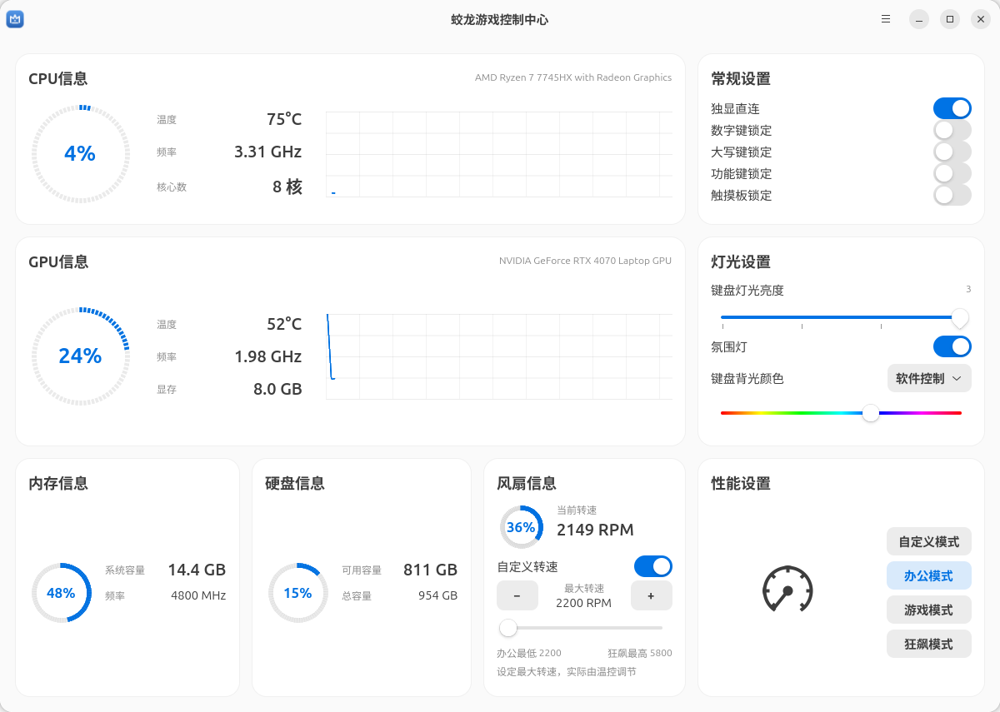
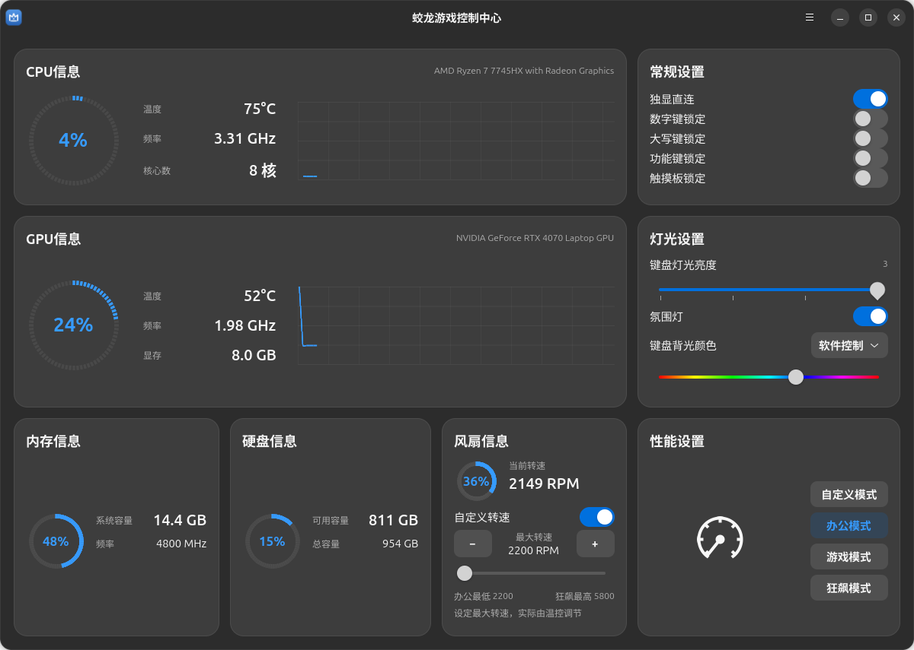

# 蛟龙控制中心 · Ubuntu 0.4

使用 GTK 4 / libadwaita 编写的机械革命蛟龙笔记本控制台，保留 Windows 原厂控制中心的八个模块排列，跟随 Ubuntu 的系统明暗和强调色。

这是独立开发的适配程序。仓库包含控制台源码、本机专用 WMI 驱动、安装工具及界面预览。



<details>
<summary>深色界面</summary>



</details>

## 当前适配范围

硬件写入严格检查下列机型和 BIOS，不匹配时拒绝操作：

| 项目 | 已验证环境 |
| --- | --- |
| 系统 | Ubuntu 26.04.1 / GNOME 50.1 / Wayland |
| 主板 | MECHREVO MRID6-23 |
| BIOS | MRID6_23_P_V36 |
| CPU | AMD Ryzen 7 7745HX |
| GPU | NVIDIA GeForce RTX 4070 Laptop GPU |
| NVIDIA 驱动 | 595.91.07 |
| 预编译内核模块 | Linux 7.0.0-38-generic / x86-64 |

其他机型、BIOS、内核及显卡驱动版本需要单独适配和验证。

## 功能

| 功能 | 实现与验证 |
| --- | --- |
| CPU / GPU 信息 | 实际温度、频率、使用率及历史曲线 |
| 内存 / 硬盘信息 | Linux 实际读数；内存频率由安装时只读获取的 SMBIOS 信息提供 |
| 独显直连 / 混合输出 | 原厂 WMI 接口；读取已验证，开发期间未更改，切换后需自行重启 |
| 数字键 / 大写键锁定 | Linux uinput；GNOME / Wayland 下开、关及恢复已实机验证 |
| Fn 锁 / 内置触控板锁 / 氛围灯 | 原厂 WMI 接口；切换、读回及恢复已实机验证 |
| 键盘灯光 | 亮度、RGB、快捷键控制 / 软件控制；亮度与 RGB 写入、读回及恢复已验证 |
| 办公 / 游戏 / 狂飙模式 | 原厂固件档位；切换与恢复已读回验证 |
| 风扇自定义 | 开关、滑块和加减按钮；2200–5800 RPM、步进 100 RPM；两个端点与自动控制恢复已实机读回验证 |
| CPU 自定义 | SPL 75–85 W、SPPT 105–120 W、温度墙 89–100°C；84 W / 119 W / 99°C 写入、读回及恢复已验证 |
| 显卡核心超频 | NVIDIA NVML 时钟偏移，0–200 MHz；+15 MHz 写入、读回及恢复已实机验证 |

风扇滑块设置的是原厂**最大转速参数**，并非固定 RPM。实际转速仍由温度、负载及固件散热逻辑决定；空闲时即使设为 5800 RPM，也可能维持约 2200 RPM。调速保持当前整机性能档位。关闭自定义开关或切换性能档位可恢复固件自动控制。

原厂依赖 Windows 热键服务的 OSD 开关不提供 Ubuntu 适配。界面保留 CPU、常规设置、GPU、灯光设置、内存、硬盘、风扇、性能八个模块的位置。

## 安装

可从 [Releases](https://github.com/heran2654/jiaolong-console/releases) 下载 0.4 安装包，也可获取本仓库源码。

安装依赖：

```sh
sudo apt install python3-gi gir1.2-gtk-4.0 gir1.2-adw-1 build-essential linux-headers-$(uname -r)
```

安装用户桌面应用：

```sh
python3 install.py
```

在当前内核下编译并安装硬件适配：

```sh
make -C driver
pkexec /usr/bin/python3 -I "$PWD/driver/install-driver.py"
```

安装器检查机型、BIOS 和模块内核版本，备份已有组件，加载驱动并执行只读握手。应用以普通用户运行；更改设置时由 polkit 认证固定路径的受限控制程序。

应用菜单搜索“蛟龙控制中心”，或运行：

```sh
jiaolong-console
```

源码运行及只读状态查询：

```sh
python3 app.py
python3 app.py --status
```

尚未配置 DKMS，内核升级后需要重新编译及安装驱动。预编译模块只匹配上表中的内核。重启后的自动加载行为尚未验证。

## 实现与验证

- 固件接口：WMI GUID `B60BFB48-3E5B-49E4-A0E9-8CFFE1B3434B`，实例 0、方法 1，32 字节数据包；读取操作 250、写入操作 251。
- 性能档位、显卡连接、Fn / 触控板锁、灯光、风扇、CPU 自定义通过原厂 WMI 方法写入；不开放任意 EC 或 SMU 写入。命令映射见 [driver/PROTOCOL.txt](driver/PROTOCOL.txt)。
- CPU 自定义参数只读 EC 字段来自已验证 BIOS 的 DSDT；驱动 probe 不改变设置。
- 锁定键通过 [Linux uinput](https://docs.kernel.org/input/uinput.html) 创建临时键盘，只生成 Num Lock / Caps Lock；不放宽 `/dev/uinput` 权限。
- 显卡核心频率偏移通过 [NVIDIA NVML](https://docs.nvidia.com/deploy/nvml-api/latest/api/group__nvmlDeviceCommands.html) 的 GetClockOffsets / SetClockOffsets。
- 八个模块坐标与原厂界面资源逐项对照，浅色、深色及自定义参数视图已渲染检查；打开、刷新和导航不触发硬件写入。
- 不包含 Windows 原厂安装包、厂商可执行文件、完整反编译结果或 BIOS 转储。

需要重新运行可恢复实机验证时：

```sh
pkexec /usr/bin/python3 -I "$PWD/driver/verify-0.4.py"
```

该工具会短暂切换锁定键、Fn / 触控板锁、氛围灯、风扇上限、GPU 偏移和 CPU 参数，结束时逐项恢复开始时的设置。它检查接口写入及读回，不将空闲风扇转速当作固定转速测试。验证报告保存在 `/var/lib/jiaolong-console/verification-0.4.json`。

用户安装目录为 `~/.local/share/jiaolong-console`，启动器为 `~/.local/bin/jiaolong-console`，硬件组件备份位于 `/var/lib/jiaolong-console`。

卸载硬件适配并恢复自动散热：

```sh
sudo /usr/bin/python3 -I driver/uninstall-driver.py
```

内核驱动的 GPL v2 许可证见 [driver/LICENSE](driver/LICENSE)。
